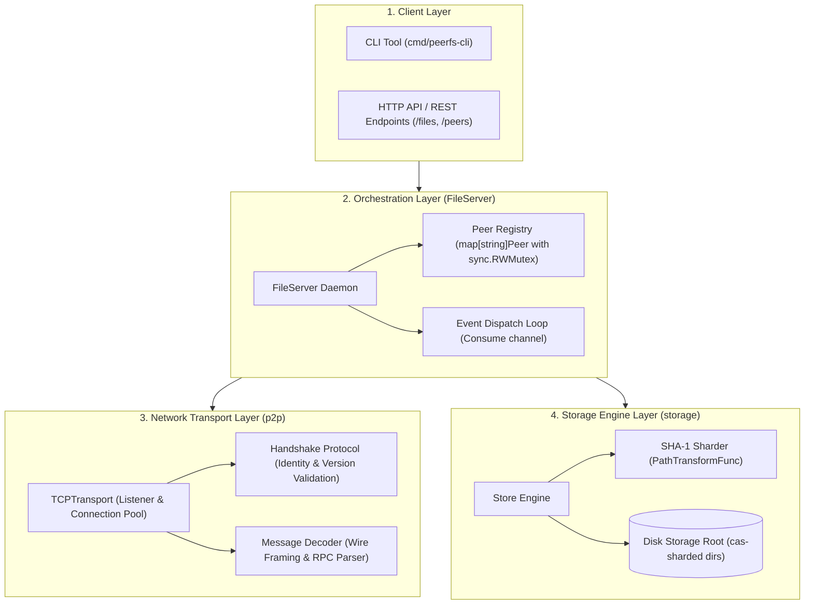
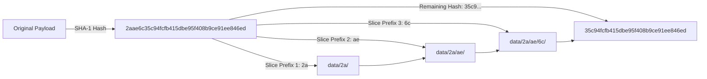
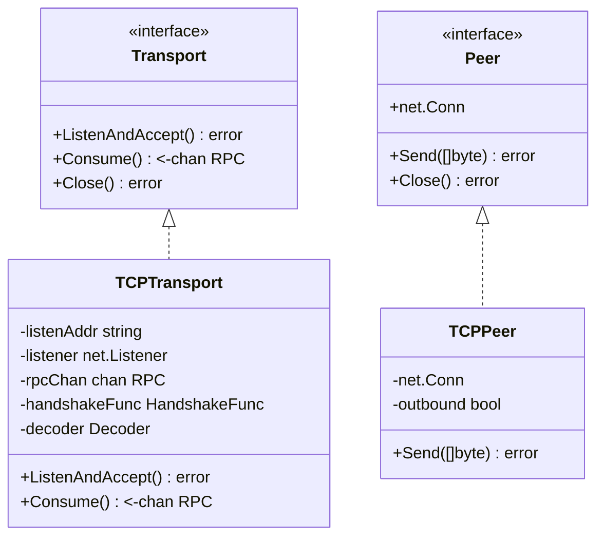
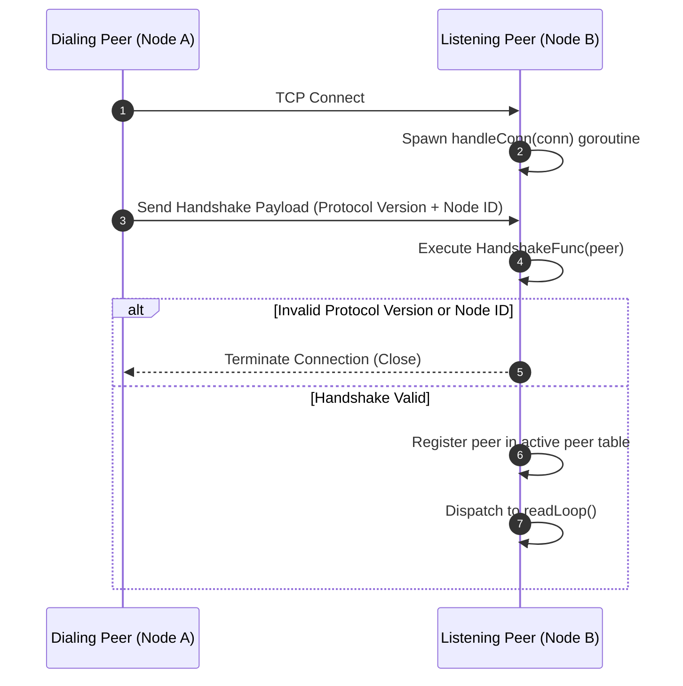
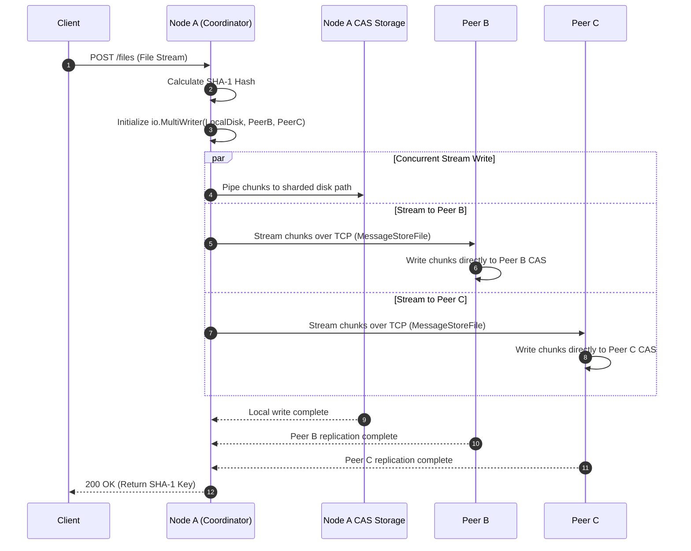
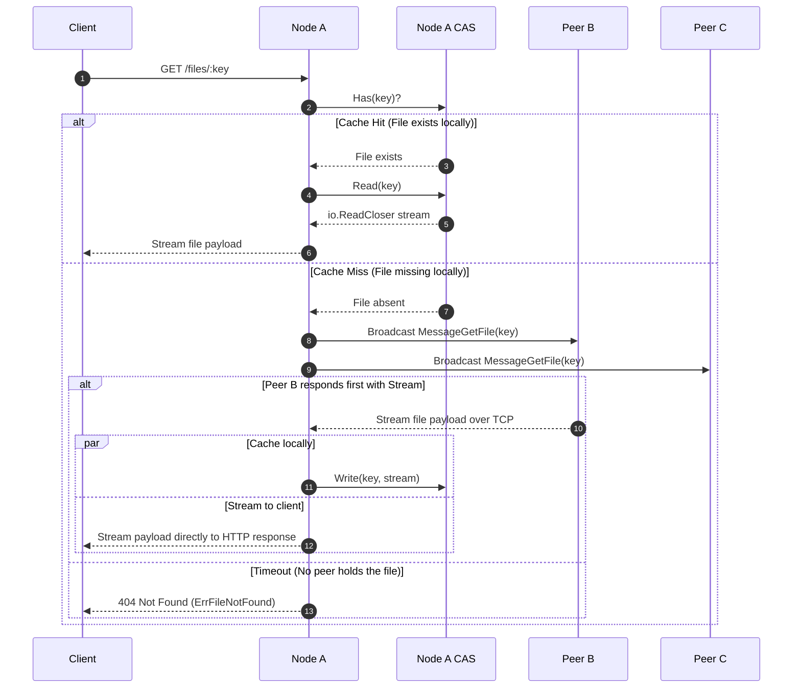
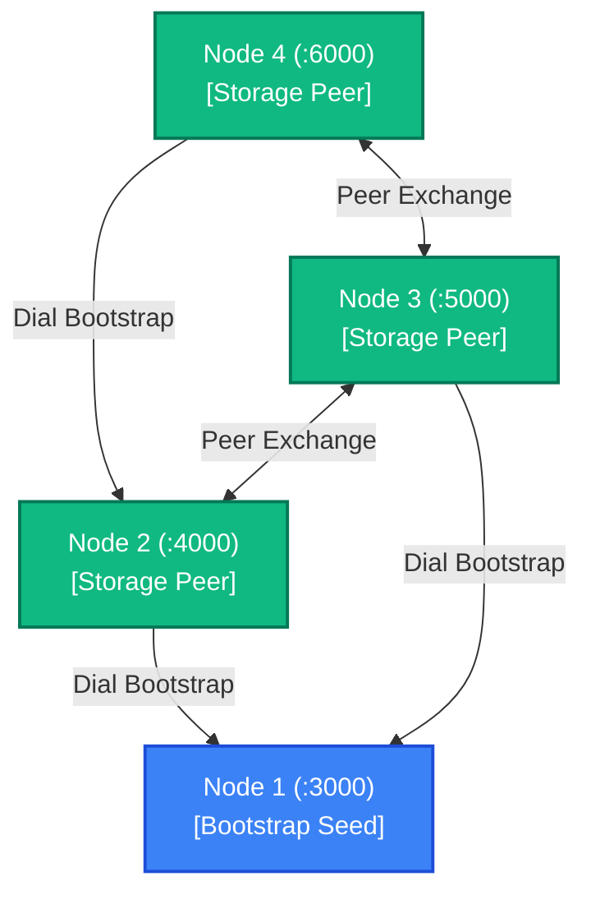

# PeerFs

> **Distributed Peer-to-Peer Content-Addressed File Storage System in Go**

PeerFs is a lightweight, decentralized, peer-to-peer (P2P) file system built from scratch in Go. It pairs a **Content-Addressed Storage (CAS)** engine with a custom, framed **TCP wire protocol**, allowing autonomous nodes to store, replicate, and retrieve data blocks across a cooperative distributed mesh without centralized servers or single points of failure.

---

## Table of Contents
- [System Architecture](#system-architecture)
- [Core Architectural Tenets](#core-architectural-tenets)
- [Content-Addressed Storage (CAS) Engine](#content-addressed-storage-cas-engine)
  - [The Flat Directory Bottleneck](#the-flat-directory-bottleneck)
  - [Deterministic SHA-1 Path Sharding](#deterministic-sha-1-path-sharding)
  - [Zero-Buffer Streaming I/O](#zero-buffer-streaming-io)
- [P2P Transport & Wire Protocol](#p2p-transport--wire-protocol)
  - [TCP Transport & Peer Abstraction](#tcp-transport--peer-abstraction)
  - [Peer Handshake & Identity Verification](#peer-handshake--identity-verification)
  - [Message Framing & RPC Decoding](#message-framing--rpc-decoding)
- [Distributed Operations](#distributed-operations)
  - [File Ingestion & Concurrent Peer Replication](#file-ingestion--concurrent-peer-replication)
  - [Remote File Retrieval & Query Routing](#remote-file-retrieval--query-routing)
  - [Cluster Topology & Bootstrap Discovery](#cluster-topology--bootstrap-discovery)
- [HTTP API & CLI Interface](#http-api--cli-interface)
- [Project Layout](#project-layout)
- [Getting Started & Development](#getting-started--development)

---

## System Architecture

PeerFs is organized into four modular layers, isolating network transport from storage semantics and orchestration:



---

## Core Architectural Tenets

1. **Content Addressing Over Human Naming**: Files are stored and retrieved purely by their cryptographic digest (SHA-1 hash). If two users upload the exact same file, it is automatically deduplicated and stored once.
2. **Zero-Buffer Stream Pipelining**: Large files are never buffered entirely in memory. Data streams directly from the incoming network socket or HTTP request through `io.MultiWriter` or `io.TeeReader` into local disk storage and peer TCP sockets simultaneously.
3. **Self-Healing Distributed Queries**: If a requested block is absent on the local node, the node queries its connected peers, downloads the stream from the first responder, caches it locally in CAS, and serves the caller in a single continuous stream.
4. **Decoupled Transport Protocols**: The transport layer is defined via a clean `Transport` interface, enabling drop-in alternatives (e.g. UDP, QUIC, WebSocket) without altering storage or replication logic.

---

## Content-Addressed Storage (CAS) Engine

### The Flat Directory Bottleneck
Standard operating system file systems (ext4, NTFS, APFS) degrade significantly in performance when tens of thousands of files are placed inside a single directory due to directory lock contention and $O(N)$ or complex B-tree directory traversal overhead.

### Deterministic SHA-1 Path Sharding
PeerFs breaks the cryptographic hash into hierarchical prefix slices to create a balanced, shallow directory tree:



- **Hash Transformation**:
  $$\text{Key} \xrightarrow{\text{SHA-1}} \texttt{2aae6c35c94fcfb415dbe95f408b9ce91ee846ed}$$
  $$\text{Storage Path} = \texttt{data/2a/ae/6c/35c94fcfb415dbe95f408b9ce91ee846ed}$$
- **Fast Lookups**: Directory depth is constant ($O(1)$ lookup time), eliminating inode contention and filesystem slowdowns.

### Zero-Buffer Streaming I/O
The `Store` interface interacts exclusively with `io.Reader` and `io.ReadCloser`:

```go
type Store struct {
    Root              string
    PathTransformFunc PathTransformFunc
}

func (s *Store) Write(key string, r io.Reader) (int64, error)
func (s *Store) Read(key string) (io.ReadCloser, error)
func (s *Store) Has(key string) bool
func (s *Store) Delete(key string) error
```

When writing, bytes pipe directly through `io.Copy(file, reader)` into disk storage, maintaining a steady $O(1)$ memory footprint regardless of file size (from 1 KB to 100 GB).

---

## P2P Transport & Wire Protocol

### TCP Transport & Peer Abstraction
Nodes communicate over bidirectional TCP sockets. The `TCPTransport` manages incoming listeners and outgoing client dials:



### Peer Handshake & Identity Verification
Before any RPC commands or file transfers are processed, connecting nodes must complete an explicit handshake:



### Message Framing & RPC Decoding
Because TCP delivers a continuous stream of bytes without message boundaries, PeerFs employs a framed message structure:

| Field | Size | Description |
| :--- | :--- | :--- |
| **MessageType** | 1 byte | Command code (e.g. `0x01` Store, `0x02` Get, `0x03` Status) |
| **PayloadLength** | 8 bytes (uint64) | Big-endian length of the subsequent payload |
| **StreamFlag** | 1 byte | Indicates whether raw streaming bytes follow |
| **Payload / Stream** | $N$ bytes | Encoded payload or raw binary file stream |

Incoming bytes are parsed by the `Decoder` and pushed onto the `Consume() <-chan RPC` channel for consumption by the `FileServer` dispatch loop.

---

## Distributed Operations

### File Ingestion & Concurrent Peer Replication
When a client uploads a file to Node A, Node A writes to its local CAS storage while simultaneously streaming the payload to all connected peers concurrently:



### Remote File Retrieval & Query Routing
When a client requests a file from Node A (`Get(key)`), Node A checks its local disk first. If the file is not found, Node A initiates a network search:



### Cluster Topology & Bootstrap Discovery
Nodes form an interconnected mesh by connecting to designated bootstrap nodes on startup:



---

## HTTP API & CLI Interface

Every node can optionally expose an HTTP server for client applications:

### Endpoints
| Method | Route | Description | Response |
| :--- | :--- | :--- | :--- |
| `POST` | `/files` | Upload file multipart form data | `{"key": "<sha1-hash>", "size": 1048576}` |
| `GET` | `/files/{key}` | Download file by its SHA-1 hash | Binary octet-stream with checksum header |
| `GET` | `/peers` | List currently connected peer addresses | `{"peers": [":4000", ":5000"]}` |

### Example CLI / cURL Usage
```bash
# Upload a document
curl -F "file=@presentation.pdf" http://localhost:8080/files
# Response: {"key":"a8f5c2d3e91b...","size":4582912}

# Download by hash
curl http://localhost:8080/files/a8f5c2d3e91b... --output downloaded.pdf

# Inspect cluster health
curl http://localhost:8080/peers
```

---

## Project Layout

```text
peerfs/
├── cmd/
│   ├── peerfs/               # Main PeerFs node daemon entry point
│   │   └── main.go
│   └── peerfs-cli/           # Optional command-line administrative client
│       └── main.go
├── p2p/                      # Peer-to-peer networking layer
│   ├── transport.go          # Transport & Peer interfaces
│   ├── tcp_transport.go      # TCP listener, dials, connection pooling
│   ├── handshake.go          # Peer handshake verification
│   ├── encoding.go           # Frame decoders & wire serializer
│   └── message.go            # RPC data structures
├── storage/                  # Content-Addressed Storage engine
│   ├── store.go              # Store implementation (Write, Read, Has, Delete)
│   ├── path.go               # Deterministic SHA-1 path sharding
│   └── store_test.go         # CAS unit test suite
├── server.go                 # FileServer orchestration & peer registry
├── server_test.go            # Multi-node integration test suite
├── go.mod                    # Module definition (peerfs)
└── README.md                 # System architecture & documentation
```

---

## Getting Started & Development

### Prerequisites
- **Go**: Version `1.22+` (or latest stable)

### Build
Compile the node daemon:
```powershell
go build ./cmd/peerfs/
```

### Run Node
```powershell
go run ./cmd/peerfs/
```

### Run Tests with Race Detection
Distributed systems with concurrent channels and network goroutines must be strictly verified for data races:
```powershell
go test -v -race ./...
```

---

## License
MIT License.
